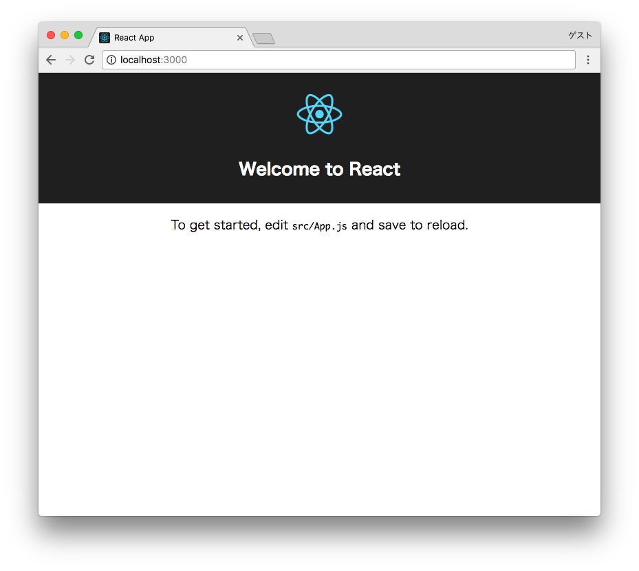

<!-- vim: nofoldenable: -->

## 手順

1. create-react-appを実行し、プロジェクトのベースを構築する
2. 開発サーバを起動し、ブラウザで確認する

```console
# 1. create-react-appを実行
$ create-react-app 任意の名前
$ cd 任意の名前
```

```console
# 2. 開発サーバを起動
# npmの場合
$ npm start

# yarnの場合
$ yarn start
```

下記の画面が出力されればOKです。



## 前ステップと差分

なし

## 今回使われているES2015以降の構文

### ES Modules

## 補足

### create-react-app

Facebook公式のReact.jsを使ったプロジェクトを簡単に構築できるツールです。昨今のWebアプリケーション開発は様々な開発ツールを利用するため、開発環境の構築に時間が掛かりますし、それぞれのツール毎に設定ファイルを用意するためプロジェクトがごちゃごちゃしてしまいます。create-react-appを使うことで下記のツールが入った開発環境を一発で用意でき、すぐにReactを使ったアプリケーション開発を始めることが可能です。

- webpackを使ったモジュール分割
- BabelによるES2015以降の最新の構文の利用
- ESLintによる静的構文解析
- Jestによる単体テスト実行

デメリットは、カスタマイズがあまり出来ない点です。

### create-react-app実行後のディレクトリ構成

- `package.json` ... プロジェクトの設定ファイル。後述
- `src/` ... ソースコード
  - `index.js`
    - 実行の起点となるファイル
    - webpackはこのファイルを起点として、全ての依存ファイルを束ねて、一つの静的なJavaScriptファイルに変換し出力します。
  - `App.js` ... Appコンポーネント
  - `App.test.js` ... Appコンポーネントの単体テスト
  - `App.css` ... CSSファイル。App.jsからimportされている
- `public/` ... 静的ファイル置き場
  - `index.html` ... HTMLファイル。ビルド後のJSファイルは動的に挿入されます。
- `build/` ... ビルドファイルの出力先。`npm run build`後に生成されます

ソースを読む際は、`src/index.js`から始めると処理を追いやすいです。

### npmとpackage.json

npmとは、Node.js Package Managerの略で、元々はNode.jsで使うモジュール群をまとめたパッケージを公開・インストールするためのツールです。昨今のWebアプリケーション開発では、ライブラリやフレームワーク、開発ツールなどがnpmパッケージとして公開されており、npmを用いてインストールするのが定番となっています。package.jsonは、npmパッケージの設定ファイルで、そのパッケージが依存しているパッケージの情報などを記載します。Webアプリケーション開発においては、そのアプリケーションが依存しているパッケージの情報を保存する目的や、この後説明するnpm run scriptsを用いたスクリプト管理に利用します。

```console
# npmパッケージのインストール
# --saveをつけることでインストールしたパッケージの情報がpackage.jsonに記録される
$ npm install --save パッケージ名
```

### npm run scriptsとreact-scripts

package.jsonのscriptsフィールドに書かれたスクリプトは、`npm run`経由で実行可能です。npm run scriptsやnpm scriptsと呼ばれています。create-react-app実行時に生成されたpackage.jsonには既に4つのスクリプトが登録されています。

```json
{
  ...,
  "scripts": {
    "start": "react-scripts start",
    "build": "react-scripts build",
    "test": "react-scripts test --env=jsdom",
    "eject": "react-scripts eject"
  }
}
```

package.jsonのscriptsフィールドを見るとわかりますが、`react-scripts`というコマンドの呼び出しになっています。`react-scripts`コマンドの内部で、webpackやESLint、Jestなどの開発ツールを呼び出す形になっているので、開発者はそれらの設定ファイルを記述する必要がありません。

各スクリプトの役割は下記のとおりです。

- `npm run start` または `npm start`
  - 開発サーバをlocalhost:3000に起動
- `npm run build`
  - 配布用のJS/HTML/CSSを生成し、buildディレクトリに出力
- `npm run test` または `npm test`
  - 単体テストの実行
- `npm run eject`
  - `react-scripts`の利用を停止し、ESLintやwebpackなどを直接使うようにプロジェクトを変更する
  - 特殊なカスタマイズを行いたい場合に使うので、プロジェクト初期に利用する必要はありません

